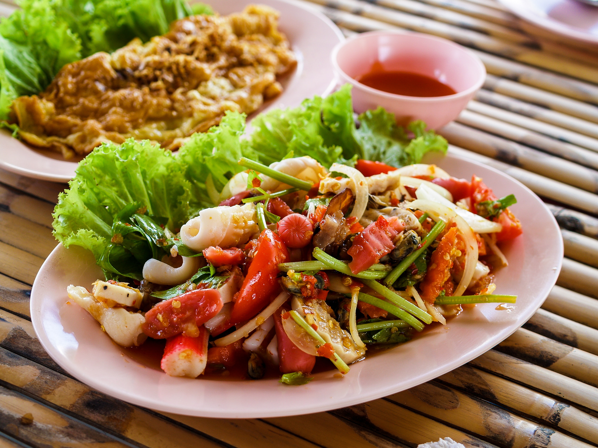

# Zomato Banagalore Restaurant Data Analysis

## You can find the well documented and detailed approach here : [link](https://medium.com/@shubhankarrawatsam.1999/zomato-bangalore-data-analysis-6ee83652890f)

Bangalore(officially known as Bengaluru) is the capital and largest city of the Indian state of Karnataka. 
With a population of over 15 million, Bangalore is the third largest city in India and 27th largest city in the world.

Bangalore has a unique food culture. Restaurants from all over the world can be found here in Bengaluru, with various kind of cuisines.
Some might even say that Bangalore is the best place for foodies.

The growing number of restaurants and dishes in Bangalore is what attracts me to inspect the data to get some insights, some interesting facts and figures.
So, in this project I will be analyzing the Zomato restaurant data for the city, Bangalore.

## Data

The dataset is taken from kaggle, you can find it [here](https://medium.com/r/?url=https%3A%2F%2Fwww.kaggle.com%2Fhimanshupoddar%2Fzomato-bangalore-restaurants).
The data is accurate to that available on the Zomato website until 15 March 2019.

The dataset contains the following features :

- **url** : This feature contains the url of the restaurant on the Zomato website
- **address** : This feature contains the address of the restaurant in Bangalore
- **name** : This feature contains the name of the restaurant
- **online_order** : whether online ordering is available in the restaurant or not
- **book_table** : table book option available or not
- **rate** : contains the overall rating of the restaurant out of 5
- **votes** : contains total number of upvotes for the restaurant
- **phone** : contains the phone number of the restaurant
- **location** : contains the neighborhood in which the restaurant is located
- **rest_type** : restaurant type
- **dish_liked** : dishes people liked in the restaurant
- **cuisines** : food styles, separated by comma
- **approx_cost(for two people)** : contains the approximate cost of meal for two people
- **reviews_list** : list of tuples containing reviews for the restaurant, each tuple consists of two values, rating and review by the customer
- **menu_item** : contains list of menus available in the restaurant
- **listed_in(type)** : type of meal
- **listed_in(city)** : contains the neighborhood in which the restaurant is located

The dataset contains **51717** rows.
